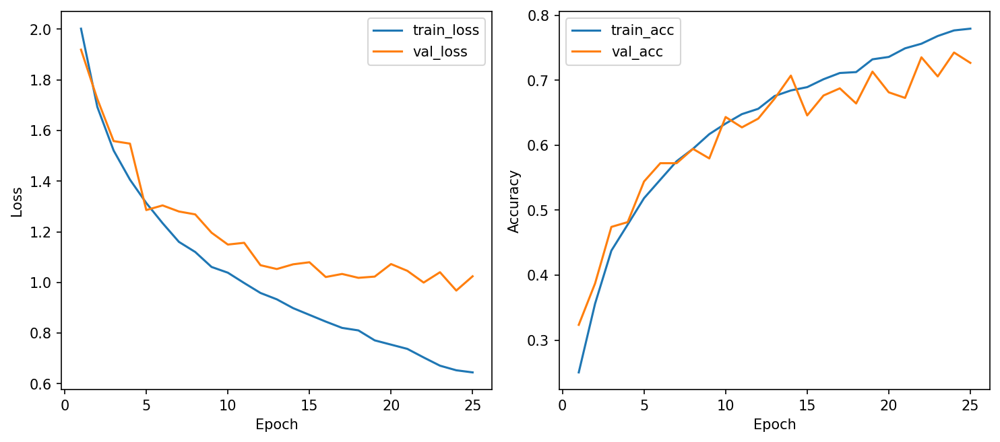
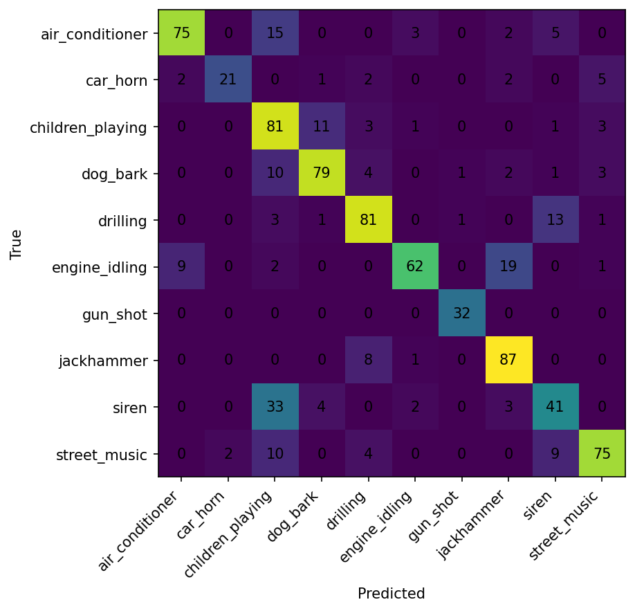

# CSC4005 Lab 4 Report – CRNN for UrbanSound8K

## 1. Thông tin sinh viên

- Họ tên: Nguyễn Văn Huy
- Mã sinh viên: 1671040013
- Lớp: KHMT 16-01
- Link GitHub repo: https://github.com/FIT-DNU-CS-16-01/csc4005-lab4-VTV-24.git
- Link W&B project: https://wandb.ai/nguyenvanhuy25021982-dai-hoc/csc4005-lab4-urbansound8k-crnn?nw=nwusernguyenvanhuy25021982

---

# 2. Mục tiêu thí nghiệm

Mục tiêu của Lab 4 là xây dựng mô hình CRNN (Convolutional Recurrent Neural Network) cho bài toán phân loại âm thanh môi trường trên bộ dữ liệu UrbanSound8K.

Trong bài lab này:

- sử dụng log-mel spectrogram để biểu diễn đặc trưng âm thanh theo cả miền thời gian và tần số,
- kết hợp CNN để học đặc trưng cục bộ và RNN để học quan hệ tuần tự theo thời gian,
- so sánh các biến thể CRNN dùng GRU và BiLSTM,
- sử dụng Weights & Biases (W&B) để theo dõi quá trình huấn luyện và đánh giá hiệu năng mô hình.

So với 1D-CNN ở Lab 3, CRNN có khả năng học phụ thuộc thời gian tốt hơn nhờ tầng recurrent, từ đó cải thiện khả năng nhận diện các pattern âm thanh phức tạp.

---

# 3. Cấu hình dữ liệu

| Thành phần | Giá trị |
|---|---|
| Dataset | UrbanSound8K |
| Số lớp | 10 |
| Train folds | 1–8 |
| Validation fold | 9 |
| Test fold | 10 |
| Feature | log-mel spectrogram |
| Sampling rate | 16 kHz |
| Duration | 4 giây |

Các lớp trong dataset:

- air_conditioner
- car_horn
- children_playing
- dog_bark
- drilling
- engine_idling
- gun_shot
- jackhammer
- siren
- street_music

---

# 4. Cấu hình mô hình

| Thành phần | Giá trị |
|---|---|
| Model | CRNN |
| CNN blocks | 2 Conv2D blocks |
| RNN type | GRU / BiLSTM |
| Hidden size | 128 |
| Dropout | 0.3 |
| Optimizer | AdamW |
| Learning rate | 1e-3 |
| Batch size | 32 |
| Epochs | 25 |

Kiến trúc tổng quát:

```text
Input log-mel spectrogram
→ CNN feature extractor
→ Temporal sequence
→ GRU / BiLSTM
→ Fully Connected classifier
→ Softmax
```

CRNN kết hợp:

- CNN để học đặc trưng không gian trên spectrogram,
- RNN để mô hình hóa quan hệ thời gian giữa các frame âm thanh.

---

# 5. Kết quả huấn luyện

| Run | best_val_acc | test_acc | Ghi chú |
|---|---:|---:|---|
| logmel_crnn_gru_baseline | 0.7426 | 0.7575 | Kết quả tốt nhất |
| logmel_crnn_bilstm_extension | 0.6605 | 0.7061 | BiLSTM ổn định nhưng chậm hơn |
| debug_logmel_crnn | 0.3591 | 0.4636 | Tiny CRNN để debug pipeline |

Ngoài accuracy, mô hình baseline còn đạt:

- test_loss = 0.7597
- total_params = 71,338
- avg_epoch_time ≈ 125.64 giây

Trong khi đó BiLSTM extension:

- test_loss = 0.8291
- total_params = 150,250
- avg_epoch_time ≈ 132.93 giây

Mặc dù BiLSTM có nhiều tham số hơn và học được ngữ cảnh hai chiều, mô hình GRU baseline lại cho kết quả tốt hơn trên tập test.

---

# 6. Learning curves



## Nhận xét

- Train loss giảm đều theo epoch cho thấy mô hình học ổn định.
- Validation loss giảm mạnh ở giai đoạn đầu và dần hội tụ ở các epoch cuối.
- Validation accuracy tăng đều và đạt khoảng 0.74 ở mô hình baseline.
- Khoảng cách giữa train accuracy và validation accuracy không quá lớn nên overfitting chưa nghiêm trọng.
- BiLSTM extension có xu hướng học chậm hơn và validation accuracy thấp hơn baseline.
- Debug CRNN có accuracy thấp do mô hình quá nhỏ và số tham số rất ít.

Trong các run chính:

- early stopping không kích hoạt quá sớm,
- learning curves tương đối ổn định,
- không xuất hiện hiện tượng divergence hoặc exploding loss.

---

# 7. Confusion matrix



## Nhận xét

Các lớp được phân loại tốt:

- gun_shot
- jackhammer
- dog_bark
- drilling
- street_music

Đặc biệt:

- gun_shot đạt recall = 1.0,
- jackhammer đạt recall ≈ 0.91,
- drilling đạt recall ≈ 0.81.

Các lớp dễ bị nhầm:

- siren ↔ children_playing
- engine_idling ↔ air_conditioner
- drilling ↔ jackhammer

Nguyên nhân:

- các lớp âm thanh máy móc có phổ tần khá giống nhau,
- âm thanh môi trường chứa nhiều nhiễu nền,
- một số lớp có pattern năng lượng tương tự trên spectrogram.

So với debug model:

- baseline CRNN cho confusion matrix rõ ràng hơn,
- số lượng prediction đúng trên diagonal tăng đáng kể.

---

# 8. So sánh với Lab 3 1D-CNN

| Tiêu chí | Lab 3: 1D-CNN | Lab 4: CRNN |
|---|---|---|
| Feature chính | MFCC / log-mel | log-mel |
| Khả năng học pattern cục bộ | Có | Có |
| Khả năng học quan hệ thời gian | Hạn chế | Tốt hơn |
| Test accuracy | 0.6043 (best Lab 3) | 0.7575 |
| Nhận xét | Train nhanh, kiến trúc đơn giản | Accuracy cao hơn, học temporal pattern tốt hơn |

## Phân tích

CRNN cải thiện rõ rệt so với 1D-CNN:

- tăng khoảng 15% test accuracy,
- confusion matrix tốt hơn,
- giảm nhầm lẫn giữa các lớp môi trường.

Nguyên nhân chính:

- CNN xử lý tốt đặc trưng phổ,
- GRU/LSTM học được quan hệ thời gian giữa các frame audio,
- log-mel spectrogram phù hợp với CNN hơn MFCC sequence trong bài toán này.

Tuy nhiên:

- CRNN train chậm hơn đáng kể,
- yêu cầu GPU và tài nguyên lớn hơn.

---

# 9. Kết luận

Qua Lab 4, em đã xây dựng thành công mô hình CRNN cho bài toán phân loại âm thanh môi trường trên UrbanSound8K.

Kết quả thực nghiệm cho thấy:

- CRNN cải thiện đáng kể so với mô hình 1D-CNN ở Lab 3,
- log-mel spectrogram là đặc trưng phù hợp cho CNN-based audio classification,
- mô hình GRU baseline đạt kết quả tốt nhất với test accuracy khoảng 75.75%.

Ngoài ra:

- BiLSTM giúp mô hình học ngữ cảnh hai chiều nhưng chưa vượt qua GRU baseline,
- confusion matrix cho thấy các lớp âm thanh rõ ràng như gun_shot và jackhammer được nhận diện rất tốt,
- các lớp môi trường liên tục như siren hoặc engine_idling vẫn còn bị nhầm lẫn.

Nếu tiếp tục cải thiện mô hình, em sẽ:

- tăng cường data augmentation,
- sử dụng attention mechanism,
- thử pretrained audio model,
- tuning learning rate và regularization,
- sử dụng deeper CNN backbone.

---

# 10. Link minh chứng

- GitHub commit cuối:  
  https://github.com/FIT-DNU-CS-16-01/csc4005-lab4-VTV-24

- W&B run baseline:  
 https://wandb.ai/nguyenvanhuy25021982-dai-hoc/csc4005-lab4-urbansound8k-crnn?nw=nwusernguyenvanhuy25021982

- W&B run mở rộng:  
 https://wandb.ai/nguyenvanhuy25021982-dai-hoc/csc4005-lab4-urbansound8k-crnn?nw=nwusernguyenvanhuy25021982